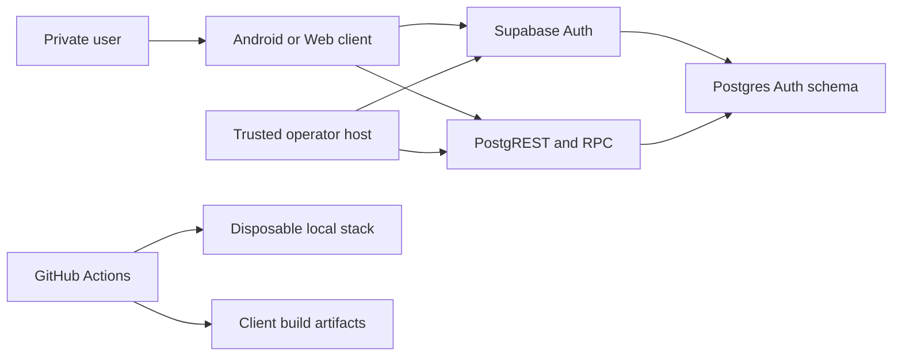

# Stone Set identity and session threat model

## Executive summary

The highest-risk areas are the Postgres authorization boundary, server-verifiable
first-password-change proof, and trusted operator credential isolation. The corrected dependency
family now restores, generates, analyzes and passes client tests. Disabled signup, exhaustive
privilege tests, RLS, live-session checks, application revocation state, dry-run-first operator
tooling and a real Auth password-update integration test are present. Local Docker and Android SDK
availability make the database replay, Auth-audit proof and Android build CI-proven rather than
locally repeated; GitHub Actions run `31092177135` passed those gates.

## Scope and assumptions

In scope: `apps/mobile/`, `apps/dashboard/`, `packages/domain/`, `packages/data/`, `packages/ui/`,
`supabase/`, `tool/operator/`, and `.github/workflows/foundation-ci.yml` on
`codex/task-imp-002a-identity-sessions`.

Assumptions validated against the repository and the user's local-only execution request; a
check-in invited correction before this model was finalized and no conflicting assumption was
introduced:

- Stone Set is a private two-user application, not an open multi-tenant service.
- Android and the publicly downloadable static Flutter Web bundle are untrusted clients.
- Only local Supabase work is authorized in this task; no remote environment was accessed.
- Supabase Auth owns passwords and sessions; Postgres cannot inspect password material.
- Operator service-role credentials exist only in a trusted, separately controlled environment.

Out of scope: later product data, Storage/media, workouts and offline persistence, remote
staging/production provisioning, Vercel deployment, Android signing, and availability engineering.

Open questions that change risk ranking: the final controlled alias domain or supported no-op email
hook; the production operator host/secret store; and the configured production JWT expiry. The real
local Auth lifecycle test observes the required audit payload in CI. Local JWT expiry is explicitly
fixed at one hour.

## System model

### Primary components

- Android and Web Auth views/controllers consume shared domain contracts and the Supabase identity
  repository (`apps/mobile/lib/features/identity/`, `apps/dashboard/lib/src/session/`,
  `packages/data/lib/src/identity/`).
- Supabase Auth owns credential verification, persisted sessions, refresh and password updates
  (`packages/data/lib/src/identity/supabase_identity_repository.dart`).
- Postgres owns profiles, preferences, capabilities, compatibility, authorization state, audit
  events and RPC enforcement (`supabase/migrations/20260806000100_identity_sessions.sql`).
- Trusted Node tooling uses a service-role key from environment input for explicit account lifecycle
  operations (`tool/operator/operator-lib.mjs`).
- CI restores exact dependencies, builds clients and runs a disposable local Supabase stack
  (`.github/workflows/foundation-ci.yml`).

### Data flows and trust boundaries

- User → Android/Web: username and password through Flutter widgets; username is trimmed,
  lowercased and grammar checked; password is sent only to Supabase Auth over HTTPS in deployed
  environments. Client rate limiting is not authoritative.
- Android/Web → Supabase Auth: internal alias/password, refresh token, password update and sign-out
  over the Supabase Auth API; Auth returns access/refresh session material. The client must bootstrap
  before private content.
- Android/Web → PostgREST/RPC: JWT plus bootstrap/update calls over HTTPS; explicit function
  `EXECUTE`, live `auth.sessions` evidence, application revocation state, profile status and RLS are
  independent authorization gates.
- Supabase Auth → Postgres proof boundary: `auth.audit_log_entries` supplies post-requirement
  password-update evidence; the candidate function binds actor ID to `auth.uid()` and consumes an
  event once, but does not prove the password value or guarantee same-session origin.
- Operator host → Auth/Data API: service-role bearer credential, account attributes and lifecycle
  RPCs over HTTPS; CLI arguments forbid secret-like inputs, execution is dry-run by default, and
  production needs an explicit confirmation flag.
- Developer/CI → local toolchain: manifests, generated sources, tests and migrations; exact restore,
  zero-output regeneration, strict analysis and clean replay are release gates. The approved
  Analyzer-12-compatible graph now passes its local dependency and client verification gates.

#### Diagram

## Assets and security objectives

| Asset | Why it matters | Security objective (C/I/A) |
|---|---|---|
| Passwords and Auth tokens | Account takeover if disclosed; never repository data | C, I |
| Service-role credential | Bypasses ordinary client authorization | C, I |
| Profile/account status | Controls access and password-change requirement | I, C |
| Preferences and identity events | Private user data and security evidence | C, I |
| Session/revocation state | Determines whether stale tokens retain app access | I, A |
| Password-change proof records | Gate first access after provision/reset | I |
| Client bundles and caches | May expose private data or embedded credentials | C, I |
| Migrations, tests and lockfiles | Define and prove the deployed security boundary | I, A |

## Attacker model

### Capabilities

- Download, inspect and modify the Flutter Web bundle or Android client.
- Send arbitrary Auth, PostgREST and RPC requests with no token or a token for one provisioned user.
- Replay a still-valid issued JWT and manipulate client-side state, metadata and route URLs.
- Submit malicious usernames, display names, locale/timezone values and operator CLI flags where the
  attacker has access to those surfaces.
- Observe generic public network behavior and attempt public or anonymous signup.

### Non-capabilities

- The attacker is not assumed to control the operator host, CI repository settings, Supabase control
  plane, TLS endpoints or service-role secret initially.
- The attacker cannot directly inspect passwords through Postgres or derive another user's Auth
  token from repository content.
- Product records and remote production data do not exist in this task.

## Entry points and attack surfaces

| Surface | How reached | Trust boundary | Notes | Evidence (repo path / symbol) |
|---|---|---|---|---|
| Auth login/update/refresh | Supabase Auth API | Client → Auth | Username maps to internal alias; no signup UI | `SupabaseIdentityRepository` |
| Bootstrap and update RPCs | PostgREST function calls | Client → Postgres | JWT, session ledger, profile and function grants | `public.get_authenticated_bootstrap` |
| Direct table API | PostgREST tables | Client → RLS | Object grants and RLS must both deny abuse | migration grants/policies |
| Password completion | Auth update then RPC | Auth/client → proof function | Consumes matching audit event | `private.complete_required_password_change` |
| Operator CLI | Local process arguments/environment | Operator → Auth/Data API | Service role; dry-run default | `executeCommand` |
| Browser routes/caches | URL, refresh, back navigation | Browser → Web app | Must not flash or retain private state | `dashboard_router.dart`, `dashboard_private_cache.dart` |
| CI/local database | Pull request workflow | Developer → build/local stack | Exact restore and disposable DB gates | `foundation-ci.yml` |

## Top abuse paths

1. Attacker calls Auth signup directly → configuration drift permits user creation → an unprovisioned
   or attacker-controlled identity reaches Auth. Impact: account boundary bypass.
2. Authenticated user calls exposed tables/functions directly → an unintended grant or RLS defect
   bypasses ownership → another user's profile/preferences or server flags change. Impact: privacy and
   authorization compromise.
3. Client calls password-completion RPC without a real update → proof query accepts stale/misbinding
   audit evidence → `must_change_password` clears. Impact: temporary-password takeover persists.
4. Operator secret enters a client define, log or artifact → attacker extracts service role → admin
   Auth and operator RPCs become available. Impact: full identity compromise.
5. Operator records revocation → attacker replays an issued JWT → a protected path omits live
   application authorization → stale token accesses data until expiry. Impact: revoked access persists.
6. Staging uses a bouncing/fake alias domain → password/reset delivery behavior becomes ambiguous or
   identity aliases leak as contact email. Impact: unsafe provisioning and privacy confusion.
7. Dependency pins drift from the proven coordinated family → incompatible analyzers/builders
   generate or validate the wrong code → security tests are skipped or misleading. Impact:
   unreviewed runtime.
8. User logs out or is disabled → browser/provider cache remains → private data appears through back
   navigation or account transition. Impact: local cross-session disclosure.

## Threat model table

| Threat ID | Threat source | Prerequisites | Threat action | Impact | Impacted assets | Existing controls (evidence) | Gaps | Recommended mitigations | Detection ideas | Likelihood | Impact severity | Priority |
|---|---|---|---|---|---|---|---|---|---|---|---|---|
| TM-001 | Remote unauthenticated caller | Auth endpoint reachable | Create public/anonymous user directly | Bypasses private provisioning | Account boundary | Global `enable_signup=false`, anonymous false, no client creation; config/runtime tests pass in CI | Remote config not in scope; email/password provider must remain enabled for provisioned login | Keep runtime denial in CI and environment release checks; never add client signup | Alert on unexpected Auth user creation source | low | high | medium |
| TM-002 | Authenticated user | Own valid JWT | Call tables/RPCs to read or mutate another user/server flags | Cross-user disclosure or privilege change | Profiles, preferences, authorization | Explicit revokes/grants, RLS, `auth.uid()` ownership, live session checks; exhaustive catalog privilege/RLS/function matrices passed in CI | Every future protected object/function must retain the same boundary | Retain CI clean reset, pgTAP object/row/function matrix and manual grant review | Audit denied RPCs and anomalous account events | medium | high | high |
| TM-003 | Client/build attacker | Operator secret leaks to public artifact or logs | Use service role against Auth/operator RPCs | Full identity administration | Service credential, all accounts | Environment-only credential, secret CLI args rejected, clients do not depend on tooling; `operator-lib.mjs` | Production secret store/host unspecified; bundle scan unrun | Define production secret storage and restricted operator host; retain bundle/secret scanning | Alert on service-role actions outside operator network/process | low | high | high |
| TM-004 | User holding temporary or compromised session | Matching audit event can be created or reused | Clear password flag with misbound proof | Persistent access without required change | Password proof and account status | Actor matches current `auth.uid()`, event after requirement and within 24h, one-time proof table; CI lifecycle test denies pre-update/direct clear, performs a real Auth password update, then completes | Same-user cross-session limitation remains | Preserve the lifecycle integration test and evidence contract; document same-user cross-session limitation; reduce evidence window if supported | Record correlation, event ID and completion failures | medium | high | high |
| TM-005 | Revoked authenticated user | JWT remains cryptographically valid | Replay token against path lacking current-session check | Access after operator revocation | Session and private data | `auth.sessions` lookup, selected/global application revocation state, active profile check; candidate pgTAP | JWT expiry not configured here; every future protected function must reuse guard | Record production JWT tolerance; mandate guard helper for protected paths; foreground/bootstrap revalidation | Alert on calls using revoked session IDs | medium | high | high |
| TM-006 | Misconfigured operator/deployment | Staging/production alias strategy absent | Provision with fake/bouncing domain or expose alias | Recovery/delivery failure and identity confusion | Alias and account lifecycle | Local-only synthetic domain; non-local controlled-domain/no-op-hook validation | Final domain/hook not selected | Block non-local provisioning until controlled strategy has evidence and runbook | Audit provisioning strategy/environment | medium | medium | medium |
| TM-007 | Developer or dependency drift | Pressure to update one package in isolation | Force overrides or commit stale generated output | Invalid security verification and build integrity | Lockfile, generated code, tests | Proven coordinated exact family, one root lockfile, no overrides, clean first and zero-output second generation, strict analysis and CI freshness pass | Future updates could drift | Keep exact pins coordinated and fail CI on restore or generated diff | CI restore/generation freshness failures | low | high | medium |
| TM-008 | Local browser/device user | Logout, disable or account transition | Recover cached/private UI state | Private local disclosure | Client cache and route state | User-partitioned caches, dashboard clear hooks, checking routes, logout/back-navigation, quarantine and CI browser tests | Android later persistence is placeholder | Keep browser test, provider invalidation and quarantine contracts as merge gates | Client-safe state transition telemetry | medium | medium | medium |

## Criticality calibration

- Critical: immediate unauthenticated service-role exposure or reliable cross-user Auth bypass at
  internet scale; destructive remote database control; production credential committed to a public
  client. None is currently proven.
- High: exploitable cross-user RLS/function bypass; clearing password-change without valid Auth
  evidence; revoked sessions retaining application access because a protected path omits the guard.
- Medium: configuration drift caught by release checks; alias strategy failure before production;
  device-local cache disclosure requiring access to the user's browser/device.
- Low: generic state-code disclosure without account enumeration; noisy denial-of-service against a
  two-user local environment; malformed input rejected by constraints with no data impact.

## Focus paths for security review

| Path | Why it matters | Related Threat IDs |
|---|---|---|
| `supabase/migrations/20260806000100_identity_sessions.sql` | Entire grants/RLS/session/proof/operator boundary | TM-002, TM-004, TM-005 |
| `supabase/tests/database/identity_security.test.sql` | Independent allow/deny and stale-token proof | TM-002, TM-004, TM-005 |
| `supabase/config.toml` | Public/anonymous signup and password policy | TM-001 |
| `supabase/tests/integration/signup_disabled.integration.test.mjs` | Running Auth denial proof | TM-001 |
| `supabase/tests/integration/identity_lifecycle.integration.test.mjs` | Real Auth password-update and audit-event proof | TM-004 |
| `tool/operator/operator-lib.mjs` | Service-role handling, environment boundaries and account lifecycle | TM-003, TM-006 |
| `packages/data/lib/src/identity/supabase_identity_repository.dart` | Auth session handling, bootstrap decoding and password flow | TM-004, TM-005 |
| `apps/dashboard/lib/src/session/` | Cache clearing, refresh and external sign-out behavior | TM-005, TM-008 |
| `apps/mobile/lib/features/identity/controllers/` | Foreground revalidation, quarantine and logout | TM-005, TM-008 |
| `.github/workflows/foundation-ci.yml` | Exact restore, generation, database and secret gates | TM-001, TM-003, TM-007 |
| `pubspec.lock` and workspace member manifests | Proven coordinated dependency graph | TM-007 |

Quality check: all discovered Auth, Data API, operator, client-cache and CI entry points are covered;
each trust boundary appears in at least one threat; runtime controls are separated from operator/CI
controls; the two-user/local-only assumptions are explicit; CI Auth-audit proof passed; and unresolved
production alias, secret-storage and production JWT-expiry decisions remain visible.
