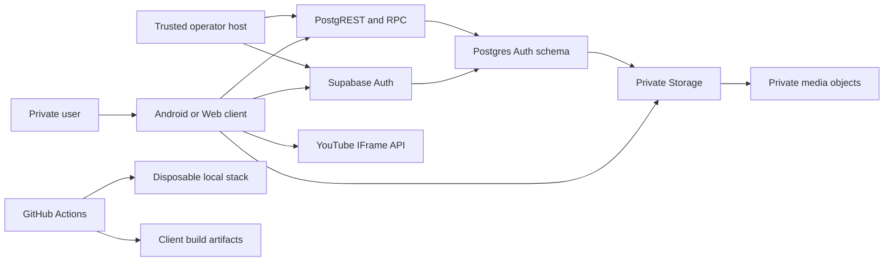

# Stone Set identity, session, exercise-guidance and media threat model

## Executive summary

The highest-risk areas are the Postgres authorization boundary, server-verifiable
first-password-change proof, and trusted operator credential isolation. The corrected dependency
family now restores, generates, analyzes and passes client tests. Disabled signup, exhaustive
privilege tests, RLS, live-session checks, application revocation state, dry-run-first operator
tooling and a real Auth password-update integration test are present. Local Docker and Android SDK
availability make the database replay, Auth-audit proof and Android build CI-proven rather than
locally repeated; final GitHub Actions run `31093560109` passed those gates before pull request #7
merged at `2281be745b75116e70d2fed9ccf85c60e79bc4aa`.

`TASK-IMP-003B` adds a second high-risk persistence boundary between the untrusted Web client,
private Supabase Storage and Postgres media metadata, plus a privacy boundary with YouTube. The
candidate uses owner-bound upload intents, immutable paths, short-lived publication reservations,
Storage RLS and transactional finalization, but Storage API calls and Postgres transactions remain
non-atomic. Browser-computed hashes, dimensions and sanitized-image claims are reconciliation
evidence only, not server byte inspection or malware attestation. Likewise, a recent official-player
playable event is client-reported preview evidence, not YouTube-server availability attestation.

## Scope and assumptions

In scope: `apps/mobile/`, `apps/dashboard/`, `packages/domain/`, `packages/data/`, `packages/ui/`,
`supabase/`, `tool/operator/`, and `.github/workflows/foundation-ci.yml`, including the bounded
`TASK-IMP-003B` candidate on `codex/task-imp-003b-exercise-media-youtube`.

Assumptions validated against the repository and the user's local-only execution request; a
check-in invited correction before this model was finalized and no conflicting assumption was
introduced:

- Stone Set is a private two-user application, not an open multi-tenant service.
- Android and the publicly downloadable static Flutter Web bundle are untrusted clients.
- Only local Supabase work is authorized in this task; no remote environment was accessed.
- Supabase Auth owns passwords and sessions; Postgres cannot inspect password material.
- Operator service-role credentials exist only in a trusted, separately controlled environment.
- The `exercise-media` bucket is private and local-only in this task; no remote bucket, cleanup
  scheduler, backup job or restore drill is claimed.
- The dashboard is an untrusted public client. Image bytes, image parser input, media evidence and
  YouTube preview events supplied by it are attacker-controllable even for an authenticated owner.

Out of scope: Android media playback, routines, workouts and offline workout persistence, remote
staging/production provisioning, Vercel deployment, Android signing, production backup execution,
and broad availability engineering.

Open questions that change risk ranking: the final controlled alias domain or supported no-op email
hook; the production operator host/secret store; and the configured production JWT expiry. The real
local Auth lifecycle test observes the required audit payload in CI. Local JWT expiry is explicitly
fixed at one hour. Media-specific open questions are the production operator process that will run
Storage reconciliation/deletion, the independent object-backup destination, and whether a future
trusted byte-inspection or malware-scanning boundary is warranted for use beyond the two trusted
initial users.

## System model

### Primary components

- Android and Web Auth views/controllers consume shared domain contracts and the Supabase identity
  repository (`apps/mobile/lib/features/identity/`, `apps/dashboard/lib/src/session/`,
  `packages/data/lib/src/identity/`).
- Supabase Auth owns credential verification, persisted sessions, refresh and password updates
  (`packages/data/lib/src/identity/supabase_identity_repository.dart`).
- Postgres owns profiles, preferences, capabilities, compatibility, authorization state, audit
  events and RPC enforcement (`supabase/migrations/20260806000100_identity_sessions.sql`).
- Trusted Node tooling uses a service-role key from environment input for explicit account lifecycle
  operations (`tool/operator/operator-lib.mjs`).
- CI restores exact dependencies, builds clients and runs a disposable local Supabase stack
  (`.github/workflows/foundation-ci.yml`).
- Postgres owns the fixed muscle taxonomy, owner-scoped exercises, mutable guidance drafts,
  immutable published revisions, canonical hashes and idempotent mutation evidence
  (`supabase/migrations/20260807104329_exercise_guidance.sql`).
- The dashboard authoring repository uses Supabase as authority and a non-authoritative,
  user-partitioned IndexedDB cache for draft recovery (`apps/dashboard/lib/src/features/exercises/`).
- The dashboard media controller selects and preprocesses an owner-supplied image in memory, then
  coordinates a server-created upload intent, private Storage upload and Postgres finalization
  (`apps/dashboard/lib/src/features/exercises/`,
  `packages/data/lib/src/exercise_media/`).
- Postgres owns upload intents, draft media state, immutable revision manifests, YouTube reference
  snapshots and publication reservations; the private `exercise-media` bucket owns only object bytes
  (`supabase/migrations/20260808134609_exercise_media_youtube.sql`, `supabase/config.toml`).
- The dashboard loads the official YouTube IFrame API only after explicit user action and uses the
  privacy-enhanced embed host; YouTube remains an independent third party that receives the request
  and controls playback/availability
  (`apps/dashboard/lib/src/features/exercises/views/dashboard_youtube_preview_platform_web.dart`).

### Data flows and trust boundaries

- User → Android/Web: username and password through Flutter widgets; username is trimmed,
  lowercased and grammar checked; password is sent only to Supabase Auth over HTTPS in deployed
  environments. Client rate limiting is not authoritative.
- Android/Web → Supabase Auth: internal alias/password, refresh token, password update and sign-out
  over the Supabase Auth API; Auth returns access/refresh session material. The client must bootstrap
  before private content.
- Android/Web → PostgREST/RPC: JWT plus bootstrap/update calls over HTTPS; explicit function
  `EXECUTE`, live `auth.sessions` evidence, application revocation state, profile status and RLS are
  independent authorization gates.
- Supabase Auth → Postgres proof boundary: `auth.audit_log_entries` supplies post-requirement
  password-update evidence; the candidate function binds actor ID to `auth.uid()` and consumes an
  event once, but does not prove the password value or guarantee same-session origin.
- Operator host → Auth/Data API: service-role bearer credential, account attributes and lifecycle
  RPCs over HTTPS; CLI arguments forbid secret-like inputs, execution is dry-run by default, and
  production needs an explicit confirmation flag.
- Developer/CI → local toolchain: manifests, generated sources, tests and migrations; exact restore,
  zero-output regeneration, strict analysis and clean replay are release gates. The approved
  Analyzer-12-compatible graph now passes its local dependency and client verification gates.
- Browser → image processor: attacker-controlled bytes, filename and declared MIME enter the
  in-browser decoder. Input size, signature/decoder format, extension/MIME agreement, single-frame
  state and conservative dimensions are checked before re-encoding. On Web the synchronous decode
  cannot be preempted; the 16-megapixel/12,000-edge preflight bounds, 5 MB input cap and cooperative
  phase cancellation are the documented resource boundary.
- Dashboard → Storage: processed bytes cross the authenticated Storage API using an exact
  server-issued pending path and `upsert: false`. Storage RLS binds bucket, `owner_id`, live session,
  unexpired one-use intent and exact path; the client-provided SHA-256/dimensions are not checked
  against bytes by Postgres.
- Dashboard → Postgres media RPC: metadata, expected draft/media revisions, idempotency and
  correlation evidence cross PostgREST. Finalize reconciles the Storage row's owner/path/size/MIME,
  while explicit grants, owner RLS and the existing active-session/profile guard remain separate
  controls.
- Dashboard → Storage → Postgres publication: a 15-minute reservation names exact immutable copy
  destinations, the authenticated client performs Storage copies, and a later Postgres transaction
  locks/revalidates revisions and destination rows before publishing. Failure between those systems
  can leave an unreferenced copy; expiration, quarantine and bounded cleanup claims make it
  operator-reconcilable rather than falsely atomic.
- Dashboard → private image delivery: the repository creates authenticated signed URLs for no more
  than five minutes. URLs and processed retry bytes remain ephemeral in-memory state and are
  excluded from IndexedDB, logs and authoritative metadata.
- Dashboard → YouTube: a normalized 11-character video ID and bounded start time become official
  player parameters only after explicit preview. Playable state (`playing` or `cued`) is accepted for
  that draft and must be less than one hour old at publication; error events invalidate the preview.
  This is client-reported freshness-bounded evidence, not YouTube Data API or server attestation.

#### Diagram

## Assets and security objectives

| Asset | Why it matters | Security objective (C/I/A) |
|---|---|---|
| Passwords and Auth tokens | Account takeover if disclosed; never repository data | C, I |
| Service-role credential | Bypasses ordinary client authorization | C, I |
| Profile/account status | Controls access and password-change requirement | I, C |
| Preferences and identity events | Private user data and security evidence | C, I |
| Session/revocation state | Determines whether stale tokens retain app access | I, A |
| Password-change proof records | Gate first access after provision/reset | I |
| Client bundles and caches | May expose private data or embedded credentials | C, I |
| Migrations, tests and lockfiles | Define and prove the deployed security boundary | I, A |
| Exercise definitions and guidance | Private user-authored content and immutable publication history | C, I |
| IndexedDB recovery records | Private unsynchronized draft text on a local browser | C, I, A |
| Private exercise images | User-owned instructional bytes that may contain personal/location data before sanitization | C, I, A |
| Upload intents and object paths | Gate creation of owner-scoped immutable objects | I, A |
| Media manifests and hashes | Bind published history to ordered media evidence without rewriting 003A hashes | I, A |
| Publication reservations and cleanup state | Prevent partial cross-system work from being presented as published | I, A |
| Signed media URLs | Temporary bearer access to a private object | C, I |
| YouTube references and preview evidence | External content identity and recent client-observed playability | I, A, privacy |

## Attacker model

### Capabilities

- Download, inspect and modify the Flutter Web bundle or Android client.
- Send arbitrary Auth, PostgREST and RPC requests with no token or a token for one provisioned user.
- Replay a still-valid issued JWT and manipulate client-side state, metadata and route URLs.
- Submit malicious usernames, display names, locale/timezone values and operator CLI flags where the
  attacker has access to those surfaces.
- Observe generic public network behavior and attempt public or anonymous signup.
- Submit arbitrary image bytes, misleading filenames/MIME values, decompression-heavy dimensions,
  multi-frame payloads, metadata and direct Storage/RPC requests as an authenticated owner.
- Modify server-issued paths, upload intents, publication reservations, media revisions, signed-URL
  lifetimes, YouTube URLs and client-reported preview timestamps before sending requests.

### Non-capabilities

- The attacker is not assumed to control the operator host, CI repository settings, Supabase control
  plane, TLS endpoints or service-role secret initially.
- The attacker cannot directly inspect passwords through Postgres or derive another user's Auth
  token from repository content.
- The attacker is not assumed to compromise YouTube, Supabase's Storage service or the image package
  itself; dependency/parser defects are modeled as residual supply-chain/parser risk.
- Remote production data does not exist in this task; 003A/003B records and objects exist only in the
  local migrations, bucket and clients until deployment is separately authorized.

## Entry points and attack surfaces

| Surface | How reached | Trust boundary | Notes | Evidence (repo path / symbol) |
|---|---|---|---|---|
| Auth login/update/refresh | Supabase Auth API | Client → Auth | Username maps to internal alias; no signup UI | `SupabaseIdentityRepository` |
| Bootstrap and update RPCs | PostgREST function calls | Client → Postgres | JWT, session ledger, profile and function grants | `public.get_authenticated_bootstrap` |
| Direct table API | PostgREST tables | Client → RLS | Object grants and RLS must both deny abuse | migration grants/policies |
| Password completion | Auth update then RPC | Auth/client → proof function | Consumes matching audit event | `private.complete_required_password_change` |
| Operator CLI | Local process arguments/environment | Operator → Auth/Data API | Service role; dry-run default | `executeCommand` |
| Browser routes/caches | URL, refresh, back navigation | Browser → Web app | Must not flash or retain private state | `dashboard_router.dart`, `dashboard_private_cache.dart` |
| Image selection/decoder | Dashboard file picker | Local file → browser parser | Untrusted bytes are decoded and re-encoded; Web decode is synchronously bounded, not preemptible | `dashboard_image_processor.dart` |
| Media upload/finalize | Storage API then PostgREST RPC | Client → Storage/Postgres | Exact intent/path, owner, metadata and revision gates; client digest/dimensions are evidence only | `SupabaseExerciseMediaRepository`, `finalize_guidance_media_upload_v1` |
| Media publication | Reservation, Storage copy, finalize RPC | Client/Storage → Postgres | Deliberately staged non-atomic workflow; final transaction verifies destination rows | `begin_guidance_media_publication_v1`, `finalize_guidance_media_publication_v1` |
| Private image delivery | Authenticated signed-URL API | Storage → browser | HTTPS bearer URL, maximum five-minute lifetime, no durable persistence | `createImageAccessUrl` |
| YouTube URL/preview | Text field and explicit preview action | Browser → YouTube | Strict single-video normalization; official privacy-enhanced player; playable event is client evidence | `YouTubeReferenceNormalizer`, `dashboard_youtube_preview_platform_web.dart` |
| Media cleanup/reconciliation | Private bounded claim functions then Storage API | Operator → Postgres/Storage | Quarantine and skip-locked claims only; no remote scheduler or deletion tooling in 003B | `claim_expired_guidance_media_cleanup_v1` |
| CI/local database | Pull request workflow | Developer → build/local stack | Exact restore and disposable DB gates | `foundation-ci.yml` |

## Top abuse paths

1. Attacker calls Auth signup directly → configuration drift permits user creation → an unprovisioned
   or attacker-controlled identity reaches Auth. Impact: account boundary bypass.
2. Authenticated user calls exposed tables/functions directly → an unintended grant or RLS defect
   bypasses ownership → another user's profile/preferences or server flags change. Impact: privacy and
   authorization compromise.
3. Client calls password-completion RPC without a real update → proof query accepts stale/misbinding
   audit evidence → `must_change_password` clears. Impact: temporary-password takeover persists.
4. Operator secret enters a client define, log or artifact → attacker extracts service role → admin
   Auth and operator RPCs become available. Impact: full identity compromise.
5. Operator records revocation → attacker replays an issued JWT → a protected path omits live
   application authorization → stale token accesses data until expiry. Impact: revoked access persists.
6. Staging uses a bouncing/fake alias domain → password/reset delivery behavior becomes ambiguous or
   identity aliases leak as contact email. Impact: unsafe provisioning and privacy confusion.
7. Dependency pins drift from the proven coordinated family → incompatible analyzers/builders
   generate or validate the wrong code → security tests are skipped or misleading. Impact:
   unreviewed runtime.
8. User logs out or is disabled → browser/provider cache remains → private data appears through back
   navigation or account transition. Impact: local cross-session disclosure.
9. Authenticated user alters an upload path/intent or calls Storage directly → a weak policy trusts
   path text or object ownership alone → another user's object is created/read/deleted. Impact:
   cross-user private-media disclosure or corruption.
10. Owner supplies malformed or metadata-bearing image bytes → the browser decoder exhausts the UI
    thread or the final encoder preserves sensitive EXIF/GPS → denial of service or private-location
    disclosure. Impact: dashboard availability/privacy loss.
11. Modified client lies about SHA-256, dimensions, sanitization or a YouTube playable event → the
    server treats editable evidence as byte/availability attestation → misleading integrity or
    publication state. Impact: corrupted reconciliation evidence or unavailable guidance media.
12. Storage copy succeeds but Postgres finalization fails → retry/expiry leaves an unreferenced final
    object → leaked storage consumption or premature deletion by unsafe cleanup. Impact: availability,
    privacy and recovery inconsistency.
13. A signed URL enters IndexedDB, logs or a shared browser context → another local actor uses it
    before expiry → temporary private-image disclosure. Impact: bounded confidentiality loss.
14. Merely opening the editor loads an embed, or the player remains active after hide/dispose → the
    browser contacts YouTube or continues playback without a current user action. Impact: privacy and
    policy violation.

## Threat model table

| Threat ID | Threat source | Prerequisites | Threat action | Impact | Impacted assets | Existing controls (evidence) | Gaps | Recommended mitigations | Detection ideas | Likelihood | Impact severity | Priority |
|---|---|---|---|---|---|---|---|---|---|---|---|---|
| TM-001 | Remote unauthenticated caller | Auth endpoint reachable | Create public/anonymous user directly | Bypasses private provisioning | Account boundary | Global `enable_signup=false`, anonymous false, no client creation; config/runtime tests pass in CI | Remote config not in scope; email/password provider must remain enabled for provisioned login | Keep runtime denial in CI and environment release checks; never add client signup | Alert on unexpected Auth user creation source | low | high | medium |
| TM-002 | Authenticated user | Own valid JWT | Call tables/RPCs to read or mutate another user/server flags | Cross-user disclosure or privilege change | Profiles, preferences, authorization | Explicit revokes/grants, RLS, `auth.uid()` ownership, live session checks; exhaustive catalog privilege/RLS/function matrices passed in CI | Every future protected object/function must retain the same boundary | Retain CI clean reset, pgTAP object/row/function matrix and manual grant review | Audit denied RPCs and anomalous account events | medium | high | high |
| TM-003 | Client/build attacker | Operator secret leaks to public artifact or logs | Use service role against Auth/operator RPCs | Full identity administration | Service credential, all accounts | Environment-only credential, secret CLI args rejected, clients do not depend on tooling; `operator-lib.mjs` | Production secret store/host unspecified; bundle scan unrun | Define production secret storage and restricted operator host; retain bundle/secret scanning | Alert on service-role actions outside operator network/process | low | high | high |
| TM-004 | User holding temporary or compromised session | Matching audit event can be created or reused | Clear password flag with misbound proof | Persistent access without required change | Password proof and account status | Actor matches current `auth.uid()`, event after requirement and within 24h, one-time proof table; CI lifecycle test denies pre-update/direct clear, performs a real Auth password update, then completes | Same-user cross-session limitation remains | Preserve the lifecycle integration test and evidence contract; document same-user cross-session limitation; reduce evidence window if supported | Record correlation, event ID and completion failures | medium | high | high |
| TM-005 | Revoked authenticated user | JWT remains cryptographically valid | Replay token against path lacking current-session check | Access after operator revocation | Session and private data | `auth.sessions` lookup, selected/global application revocation state, active profile check; candidate pgTAP | JWT expiry not configured here; every future protected function must reuse guard | Record production JWT tolerance; mandate guard helper for protected paths; foreground/bootstrap revalidation | Alert on calls using revoked session IDs | medium | high | high |
| TM-006 | Misconfigured operator/deployment | Staging/production alias strategy absent | Provision with fake/bouncing domain or expose alias | Recovery/delivery failure and identity confusion | Alias and account lifecycle | Local-only synthetic domain; non-local controlled-domain/no-op-hook validation | Final domain/hook not selected | Block non-local provisioning until controlled strategy has evidence and runbook | Audit provisioning strategy/environment | medium | medium | medium |
| TM-007 | Developer or dependency drift | Pressure to update one package in isolation | Force overrides or commit stale generated output | Invalid security verification and build integrity | Lockfile, generated code, tests | Proven coordinated exact family, one root lockfile, no overrides, clean first and zero-output second generation, strict analysis and CI freshness pass | Future updates could drift | Keep exact pins coordinated and fail CI on restore or generated diff | CI restore/generation freshness failures | low | high | medium |
| TM-008 | Local browser/device user | Logout, disable or account transition | Recover cached/private UI state | Private local disclosure | Client cache and route state | User-partitioned caches, dashboard clear hooks, checking routes, logout/back-navigation, quarantine and CI browser tests | Android later persistence is placeholder | Keep browser test, provider invalidation and quarantine contracts as merge gates | Client-safe state transition telemetry | medium | medium | medium |
| TM-009 | Authenticated owner with modified client | A valid JWT and direct Storage/Data API access | Forge owner/path/bucket/intent fields or enumerate/delete another owner's object | Cross-user private-media disclosure or immutable-history corruption | Private images, object paths, manifests | Private bucket; `owner_id` plus exact intent/reservation/path checks; live-session guard; no UPDATE policy; owner RLS and narrow RPCs (`20260808134609_exercise_media_youtube.sql`) | Final clean replay and complete Storage allow/deny matrix remain candidate evidence | Keep object grants, RLS, function execution and Storage policies separately tested for anonymous/owner/cross-user/revoked states | Audit denied Storage operations by correlation/path hash without logging raw signed URLs | medium | high | high |
| TM-010 | Authenticated owner or compromised local file | Ability to select attacker-crafted image bytes | Trigger oversized decode, animation/polyglot ambiguity or retain EXIF/GPS in the published object | Browser denial of service or sensitive metadata disclosure | Dashboard availability, private image bytes | 5 MB input/output cap, decoder/extension/MIME agreement, static-frame check, 16 MP/12,000-edge preflight, orientation bake and deterministic re-encode (`dashboard_image_processor.dart`) | Web synchronous decode cannot be preempted; client-only parsing is not a malware scanner | Keep malicious fixture tests, inspect final encoded bytes for metadata, review parser advisories and consider trusted scanning only if the trust/user model expands | Client-safe processing failure counts; never log filenames or bytes | medium | medium | medium |
| TM-011 | Authenticated owner with modified client | Direct RPC access after uploading arbitrary bytes | Forge hash, dimensions, sanitization result or recent YouTube preview time | Weak reconciliation evidence or unavailable/misleading media is published | Media hashes, manifests, YouTube reference | Postgres verifies Storage owner/path/size/MIME and bounds evidence; publication requires current revisions and a preview timestamp less than one hour old; comments explicitly reject attestation claims | Postgres does not inspect bytes; preview timestamp/playable event is client-reported and not YouTube-server attestation | Never use these fields for authorization; preserve the proof-boundary comments/UI wording; add trusted server inspection only behind a later explicit design | Reconciliation mismatch reports and player-runtime failures without raw URLs | medium | medium | medium |
| TM-012 | Authenticated owner, network failure or concurrent tab | Storage copy and database publication span separate systems | Interrupt after one succeeds, replay a stale reservation, or leave a destination orphan | Orphaned bytes, false-success UI or missing published media | Publication reservations, Storage objects, immutable history | 15-minute exact-path reservation, `upsert: false`, idempotency, expected revisions, row locks and final destination-row verification; UI waits for finalization | No distributed transaction; remote cleanup scheduler/operator execution is outside 003B | Keep failure state retryable; expire/quarantine deterministically; reconcile before deletion; never delete a path referenced by published metadata | Count expired reservations, incomplete copy sets and orphan candidates | medium | high | high |
| TM-013 | Local browser user, extension or accidental logger | A valid private-image URL is present in memory | Persist or disclose the bearer URL before it expires | Temporary private-image disclosure | Signed media URLs | HTTPS-only validation and maximum five-minute lifetime in `createImageAccessUrl`; no signed URL in manifest/IndexedDB contracts | Browser memory/cache and extensions remain outside application control | Revoke object URLs promptly, avoid durable/error/log state, use no-store response/cache policy where supported, and regenerate on demand | Bundle/cache inspection and client log scan for Storage signing paths/query tokens | low | high | medium |
| TM-014 | YouTube, network attacker limited by TLS, or modified client | User has elected to preview an external video | Contact YouTube without explicit action, validate on mere initialization, keep playing in background, or inject unsupported URL semantics | Third-party privacy contact, policy breach or false preview success | User privacy, preview evidence | Strict HTTPS host/query normalization; explicit load; privacy-enhanced host; `autoplay=0`; validation only on cued/playing; error path; visibility pause and listener/player disposal (`dashboard_youtube_preview_platform_web.dart`) | YouTube availability/privacy behavior can change; client can forge preview evidence; iframe API script uses a third-party origin | Retain browser lifecycle/error tests, CSP allowlist review and clear external-service disclosure; treat runtime failure as expected | Record only coarse player error category, never watch history or raw input URL | medium | medium | medium |
| TM-015 | Faulty cleanup tooling or operator | Quarantined/expired objects and published-source reuse exist | Delete a path still referenced by an immutable revision or duplicate draft source | Permanent historical-media loss | Published objects, backups and manifests | Duplicate-as-draft reuses immutable source metadata; removal does not authorize source-byte deletion; delete policy and bounded cleanup queries exclude published references | 003B supplies claims/quarantine only; operator deletion, backup and restore execution are deferred | Require operator dry-run/reconciliation, object-path manifest comparison and backup verification before deletion; test duplicate-source protection continuously | Alert on missing expected objects and any cleanup candidate that joins published metadata | low | high | medium |

## TASK-IMP-003A threat-model extension

The exercise/guidance vertical adds three trust boundaries: arbitrary authenticated Data API calls,
private browser recovery storage, and fail-closed CI lane selection. The accepted mitigations are:

| Threat | Abuse path | Impact | Implemented controls | Remaining proof |
|---|---|---|---|---|
| Cross-user product access | Modified client reads or mutates another owner's exercise/guidance or the fixed taxonomy | Private disclosure or history corruption | Explicit revokes/grants, `TO authenticated` owner RLS, active-session guard, narrow function execution and owner/anonymous/cross-user pgTAP | Clean replay and pgTAP in final CI |
| Lost update or replay | Concurrent tab sends a stale revision or repeats a mutation | Newer draft lost or publication duplicated | Expected revisions, database locks, durable idempotency, stable replay/correlation evidence, safe revision-only conflict details and delayed-client race tests | Concurrent database proof in final CI |
| Local cross-account disclosure | A browser recovers the previous user's draft after account transition | Private draft disclosure | Composite user/exercise/draft/schema keys, compare-and-swap, corruption rejection, clear-before-new-user exposure and confirmed-only 30-day cleanup | Linux browser regression in final CI |
| Cache promoted to authority | Client labels an IndexedDB value as published | False publication/history state | Cache is recovery-only; validate/publish always refetches and revalidates authoritative server revisions | End-to-end browser/database proof in final CI |
| Stored content execution | Guidance text is rendered as HTML or other executable markup | Dashboard/session compromise | Schema-v1 bounded plain strings, server validation, Flutter text rendering and no HTML/Markdown renderer | Re-review before any rich-content feature |
| CI lane bypass | New or unknown runtime path is classified as documentation-only | Required security/build gate skipped | ADR-0007 classifier tests known classes and activates every runtime lane for unknown paths | GitHub workflow execution on final head |

The migration never authorizes through editable metadata, never logs full guidance content, and
never returns guidance text in conflict details. Published revision content and server-computed
hashes are immutable. Cross-user sharing and rich content remain outside this model; private media
and YouTube are added below under the separately bounded 003B proof boundary.

Focus paths added by 003A are:

- `supabase/migrations/20260807104329_exercise_guidance.sql`;
- `supabase/tests/database/exercise_guidance_schema.test.sql` and
  `exercise_guidance_security.test.sql`;
- `packages/domain/lib/src/exercise_guidance/` and `packages/data/lib/src/exercise_guidance/`;
- `apps/dashboard/lib/src/features/exercises/`;
- `tool/ci/change-classifier.mjs` and `test/ci/change_classifier.test.mjs`.

## TASK-IMP-003B threat-model extension

The private-media candidate adds untrusted file parsing, Supabase Storage authorization, staged
Storage/Postgres publication and an external YouTube iframe. Its central rule is that media evidence
and media authority are different: owner/path/session/RLS and exact reservation state authorize an
operation; browser-derived image properties and player events support reconciliation and UX only.

| Threat | Abuse path | Impact | Candidate controls | Residual limitation / remaining proof |
|---|---|---|---|---|
| Upload-intent/path abuse | Modified client changes bucket, owner root, object path, MIME or reuses an expired intent | Cross-user write or unauthorized object creation | Server generates a 15-minute one-use intent and exact pending path; Storage INSERT policy binds `owner_id`, live authorized session and that intent; upload uses `upsert: false` | Final local Storage policy integration and full pgTAP matrix must pass on the candidate head |
| Cross-user media access | User guesses another owner's path or calls tables/functions directly | Private image/metadata disclosure | Private bucket, no object UPDATE policy, owner RLS, explicit grants, exact-path Storage helpers and generic not-found results | Signed URLs remain temporary bearer credentials once legitimately issued |
| Malicious image/metadata | Crafted file attacks the decoder or carries EXIF/GPS/script-capable data | Browser DoS or privacy disclosure | JPEG/PNG/static-WebP-only decode, MIME/extension agreement, static frame, conservative dimensions, orientation bake, re-encode and exact-final-byte hash | Web decode is synchronous and cannot be cancelled mid-decode; this is sanitization, not trusted malware scanning |
| False byte attestation | Modified client submits a fabricated hash, dimensions or metadata-stripping claim | Misleading manifest/reconciliation evidence | Postgres validates bounds and reconciles Storage owner/path/size/MIME before ready/publication state; the database comment records the limitation | Postgres does not decode the object or recompute its digest. These fields must never authorize access or be described as server-attested bytes |
| Partial publication | Storage copy succeeds but final database transaction fails, expires or loses a revision race | Orphaned copy or false-success state | Exact 15-minute reservation, idempotent copy/retry, expected revisions, row locks, destination-row check and final transaction; UI completes only after final RPC | Storage and Postgres are not atomic. Expired copy claims and reconciliation are required before operator API deletion |
| Unsafe cleanup of reused history | Duplicate-as-draft reuses a published source path and later removal is mistaken for byte deletion authority | Historical published media loss | Duplicate records retain `source_asset_id`; draft removal quarantines metadata; delete policy and cleanup claims exclude any path referenced by published metadata | 003B adds quarantine/claim foundations only. Remote scheduling, operator dry-run tooling, backup and restore execution remain 008 work |
| Signed-URL persistence | Five-minute bearer URL is stored, logged or exposed to another local browser context | Bounded private-image disclosure | Repository caps lifetime at five minutes, requires HTTPS and keeps URLs out of Postgres manifests and IndexedDB recovery | Browser memory/cache/extensions cannot be fully controlled; regenerate on demand and never place URLs in durable state or diagnostics |
| False YouTube availability proof | Modified client submits a recent timestamp without a real playable event | Unavailable reference is published | UI marks success only on official player `playing`/`cued`, errors fail closed, and publication requires evidence less than one hour old for the same current draft/media revision | The timestamp and event are client-reported; they are not YouTube-server attestation and can be forged by the owner. Availability may change at any time |
| Iframe privacy/lifecycle | Editor loads YouTube without intent or leaves playback/listeners alive when hidden/disposed | Unwanted third-party contact or background playback | Explicit preview action, `youtube-nocookie.com`, `autoplay=0`, standard controls, `visibilitychange` pause, listener removal and player destruction | Loading the preview still contacts YouTube; privacy-enhanced mode does not eliminate third-party processing |

The candidate's cleanup boundary is deliberately operational rather than automatic. Private,
bounded, skip-locked claim functions identify expired pending assets and unreferenced reservation
copies and quarantine database state. A trusted operator must compare claims with immutable manifests,
delete bytes through the Storage API, and record/retry failure without exposing object URLs. Ordinary
clients receive no claim-function execution. No remote cleanup scheduler, backup job or completed
restore evidence is part of 003B.

Focus paths added by 003B are:

- `supabase/migrations/20260808134609_exercise_media_youtube.sql` and
  `supabase/config.toml`;
- `supabase/tests/database/exercise_media_schema.test.sql`,
  `supabase/tests/database/exercise_media_security.test.sql` and
  `supabase/tests/integration/exercise_media_storage.integration.test.mjs`;
- `packages/domain/lib/src/exercise_media/` and `packages/data/lib/src/exercise_media/`;
- `apps/dashboard/lib/src/features/exercises/data/dashboard_image_processor.dart`;
- `apps/dashboard/lib/src/features/exercises/controllers/dashboard_guidance_media_controller.dart`;
- `apps/dashboard/lib/src/features/exercises/views/dashboard_youtube_preview_platform_web.dart`;
- `apps/dashboard/lib/src/features/exercises/data/dashboard_guidance_draft_cache.dart`.

## Criticality calibration

- Critical: immediate unauthenticated service-role exposure or reliable cross-user Auth bypass at
  internet scale; destructive remote database control; production credential committed to a public
  client. None is currently proven.
- High: exploitable cross-user RLS/function bypass; clearing password-change without valid Auth
  evidence; revoked sessions retaining application access because a protected path omits the guard;
  cross-user private-object access or cleanup that deletes immutable published media.
- Medium: configuration drift caught by release checks; alias strategy failure before production;
  device-local cache/signed-URL disclosure requiring access to the user's browser/device; bounded
  image-parser denial of service; orphaned media that remains private and operator-reconcilable.
- Low: generic state-code disclosure without account enumeration; noisy denial-of-service against a
  two-user local environment; malformed input rejected by constraints with no data impact; a stale
  YouTube reference that fails safely and does not affect workout completion or reward authority.

## Focus paths for security review

| Path | Why it matters | Related Threat IDs |
|---|---|---|
| `supabase/migrations/20260806000100_identity_sessions.sql` | Entire grants/RLS/session/proof/operator boundary | TM-002, TM-004, TM-005 |
| `supabase/tests/database/identity_security.test.sql` | Independent allow/deny and stale-token proof | TM-002, TM-004, TM-005 |
| `supabase/config.toml` | Public/anonymous signup and password policy | TM-001 |
| `supabase/tests/integration/signup_disabled.integration.test.mjs` | Running Auth denial proof | TM-001 |
| `supabase/tests/integration/identity_lifecycle.integration.test.mjs` | Real Auth password-update and audit-event proof | TM-004 |
| `tool/operator/operator-lib.mjs` | Service-role handling, environment boundaries and account lifecycle | TM-003, TM-006 |
| `packages/data/lib/src/identity/supabase_identity_repository.dart` | Auth session handling, bootstrap decoding and password flow | TM-004, TM-005 |
| `apps/dashboard/lib/src/session/` | Cache clearing, refresh and external sign-out behavior | TM-005, TM-008 |
| `apps/mobile/lib/features/identity/controllers/` | Foreground revalidation, quarantine and logout | TM-005, TM-008 |
| `.github/workflows/foundation-ci.yml` | Exact restore, generation, database and secret gates | TM-001, TM-003, TM-007 |
| `pubspec.lock` and workspace member manifests | Proven coordinated dependency graph | TM-007 |
| `supabase/migrations/20260808134609_exercise_media_youtube.sql` | Upload intents, Storage policy helpers, media RLS/grants, reservations, immutable manifests and cleanup claims | TM-009, TM-011, TM-012, TM-015 |
| `supabase/tests/database/exercise_media_security.test.sql` | Owner/cross-user/session/publication/duplicate-source denial evidence | TM-009, TM-012, TM-015 |
| `supabase/tests/integration/exercise_media_storage.integration.test.mjs` | Running private-bucket constraints and anonymous upload denial | TM-009 |
| `packages/data/lib/src/exercise_media/` | Exact intent/copy/finalize ordering, retry semantics and five-minute signed-URL cap | TM-009, TM-012, TM-013 |
| `apps/dashboard/lib/src/features/exercises/data/dashboard_image_processor.dart` | Untrusted image parser, resource limits, re-encoding and digest boundary | TM-010, TM-011 |
| `apps/dashboard/lib/src/features/exercises/views/dashboard_youtube_preview_platform_web.dart` | Explicit third-party load, playable/error evidence and iframe lifecycle | TM-011, TM-014 |
| `apps/dashboard/lib/src/features/exercises/data/dashboard_guidance_draft_cache.dart` | Durable browser recovery schema must exclude bytes, blob/signed URLs and player state | TM-008, TM-013 |

Quality check: all discovered Auth, Data API, Storage upload/download/copy, image-parser, YouTube,
operator cleanup, client-cache and CI entry points are covered; each trust boundary appears in at
least one threat; runtime controls are separated from operator/CI controls; the two-user/local-only
assumptions are explicit; CI Auth-audit proof passed; 003B candidate proof remains final-head work;
and unresolved production alias, secret-storage, JWT-expiry, media-backup and cleanup-operator
decisions remain visible.
